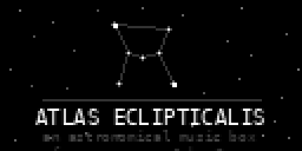
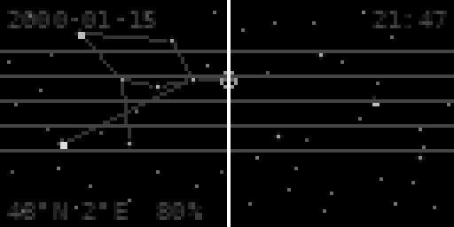

# Atlas Eclipticalis

A norns script inspired by John Cage's *Atlas Eclipticalis* (1961–62), in which Cage overlaid transparent staff paper onto astronomical star charts: stars became note heads, vertical position determined pitch, horizontal position rhythm. Every performance is unrepeatable.

This script renders a star field as a live musical score. A cursor sweeps through the sky and plays each star it crosses as a note — pitch mapped to vertical position across five staff lines, amplitude to stellar magnitude. Set a date and location in the params menu; the sky shown is astronomically accurate for that moment and place.

---



*Startup screen — twinkling Orion constellation*

---



*Playing screen — scan mode, star at cursor just triggered (flash ring visible). Staff lines, constellation lines, and HUD showing date / sidereal time / coordinates.*

---

## Installation

```
;install https://github.com/robinmeier/atlas-eclipticalis
```

Or clone into `~/dust/code/atlas-eclipticalis/`.

## Controls

| Control | Action |
|---|---|
| **E1** | Zoom in / out (centered on screen) |
| **K1 hold + E1** | Star density — percentage of stars visible |
| **E2** (cursor mode) | Pan through the sky manually; stars crossing the line play |
| **E2** (scan mode) | Scan speed — clockwise: faster, counter-clockwise: slower → stop → reverse |
| **E3** | Vertical pan (adjusts displayed latitude) |
| **K2** | Toggle cursor ↔ scan mode (switching to cursor resets speed to zero) |

Press any key on the startup screen to dismiss it.

### Modes

**Cursor mode** — the cursor sits fixed at the centre of the screen. Rotate E2 to pan the sky past it; each star that crosses plays a note. Reversing direction replays stars.

**Scan mode** — the cursor stays at centre and the sky glides past automatically at the speed set by E2. Stars trigger as they cross. Reversing the speed rewinds through the score.

## HUD

| Position | Display |
|---|---|
| Top-left | Date |
| Top-right | Sidereal time — advances or rewinds with E2 (100 virtual pixels = 1 hour) |
| Bottom | Latitude (from vertical scroll), longitude (from params), star density % |

The cursor line is **dim** in cursor mode and **bright** in scan mode.

Constellation lines are visible at zoom ≤ 1.5×. Seven constellations are drawn: Orion, Ursa Major, Cassiopeia, Scorpius, Leo, Cygnus, and Crux.

## Parameters

| Parameter | Range | Description |
|---|---|---|
| Year / Month / Day / Hour | — | Starting date and sidereal time |
| Latitude | −90 – 90 | Observer latitude (default 48°N — Paris) |
| Longitude | −180 – 180 | Observer longitude (default 2°E) |
| Pitch Base | 24 – 84 MIDI | Note at bottom of staff |
| Pitch Range | 1 – 48 semi | Semitone span from bottom to top of staff |
| Volume | 0 – 1 | Audio output level |
| Output | audio / midi / audio+midi | Signal routing |
| MIDI Device | vport list | Output MIDI port |
| MIDI Channel | 1 – 16 | Output channel |

## About

John Cage's original *Atlas Eclipticalis* was composed for any number of instruments from 1 to 86. Working in 1961–62, Cage selected pages from the *Atlas Borealis* star atlas and overlaid transparent staff paper to derive 86 independent parts. The score specifies no duration, no required instruments, and no fixed order — every realisation is a unique encounter between the performers, the time, and the stars.

This script takes that spirit into a live, interactive medium: the sky you see is real, the music it makes is yours.
